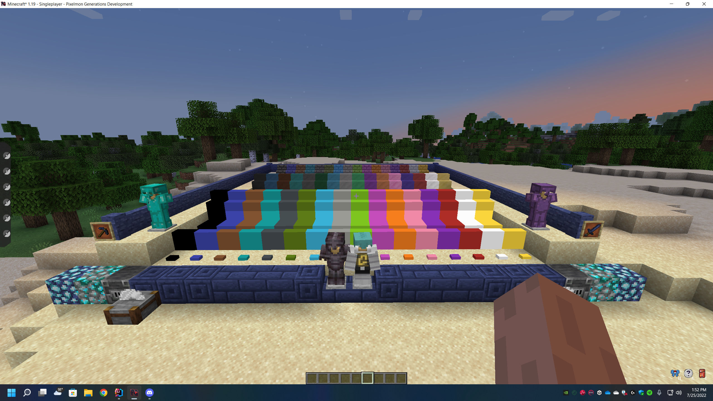

# Generations-Core

## What is Generations-Core?

Generations-Core is a mod built for Fabric and Forge that contains all of the
Blocks and items required for the Generations Mod Family

## Can this mod be used by itself?

Yes, this mod can be used by itself (Requires Architectury API), but it is not recommended. This mod is to be used with a Pokemon Mod
such as Cobblemon or PokeCraft.

## Java Version

We suggest using Java 20 for the best performance while working on the mod.
Java 17 is the minimum version required to work on the Project
Make sure you have Java 17 or newer set in Gradle Settings and in Project Structure.

## Discord
Generations Discord: https://discord.gg/generations

Generations Server Owners Discord: https://discord.gg/uEAzkeQqrN

## Website
https://generations.gg/

## How to Contribute
Create a Fork of the Repository and make a Pull Request with your changes.
Make sure to follow the Contribution Guidelines.
Pull Requests that do not follow the Contribution Guidelines will be denied.
Pull Requests are required to have 2 or more approvals before being merged by a staff member.
They also must pass the CI Checks.

 
